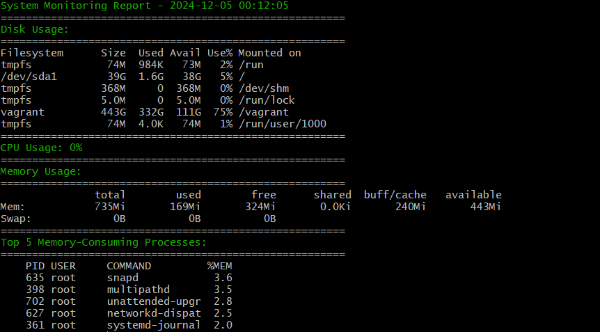

# System Monitoring Script

## Description
This is a Bash script for monitoring system performance, including disk usage, CPU usage, memory usage, and identifying the top memory-consuming processes. The script generates a report, logs the output, and sends email alerts when CPU usage exceeds a specified threshold.

## Features

 - **Disk Usage**: Displays the current disk usage for all mounted file systems.
   
  - **CPU Usage**: Monitors the CPU usage percentage. Sends an alert email if usage exceeds 85%.
-   **Memory Usage**: Shows the system's memory usage.
 -  **Top Memory-Consuming Processes**: Lists the top 5 processes consuming the most memory.
  - **Logging**: Saves the output to a timestamped log file for record-keeping.
   - **Email Alerts**: Automatically sends a notification email when CPU usage exceeds a critical threshold.

## Requirements
 - **Operating System**: Linux (Tested on Ubuntu)
 - **Dependencies**:
	- `postfix` , `sendmail` For Email Notifications
	- `tput` for colored terminal output
	- `df` , `top` , `free` ,  and `ps` (standard Linux utilities) 
	- `bc` for floating-point arithmetic

## Packages

    sudo apt update
    sudo apt install bc mailutils
    sudo apt install sendmail
## How to Use

 1. **Clone the Repository**:
	`git clone https://github.com/yatara21/DevOps-Tranining-ODC`
 2. **Change the Directory**:
    `cd system-monitor-script`
 3. **Make the Script Executable**:
	`chmod +x system_monitor.sh`
 4. ****Run the Script****:
    `./system_monitor.sh`
 5. **Automate with Cron**: To run the script periodically (e.g., every hour), add it to your crontab:
`crontab -e`
6. **Add this line**:
`* * * * * /path/to/system_monitor.sh`

## Example Output

  

